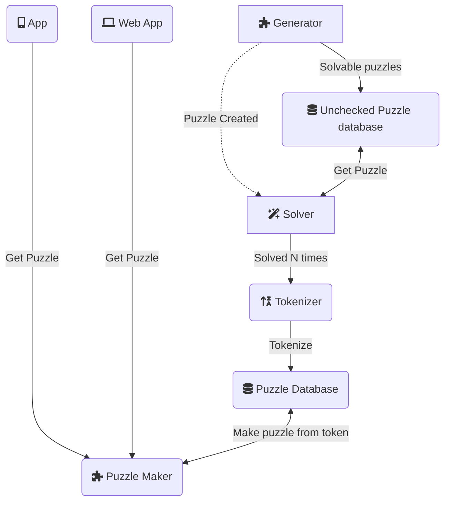

# Flow chart

```mermaid
flowchart TD
    A[fa:fa-puzzle-piece Generator] -->|Solvable puzzles| B(fa:fa-database Unchecked Puzzle database)
    A -.->|Puzzle Created| C[fa:fa-wand-magic-sparkles Solver]
    B <-->|Get Puzzle| C --> |Solved N times| D(fa:fa-arrow-up-z-a Tokenizer)
    D --> |Tokenize| E(fa:fa-database Puzzle Database) 
    A1(fa:fa-mobile-screen-button App) ------> |Get Puzzle| B1(fa:fa-puzzle-piece Puzzle Maker)
    A2(fa:fa-laptop Web App) ------> |Get Puzzle| B1
    E <--> |Make puzzle from token| B1
```
